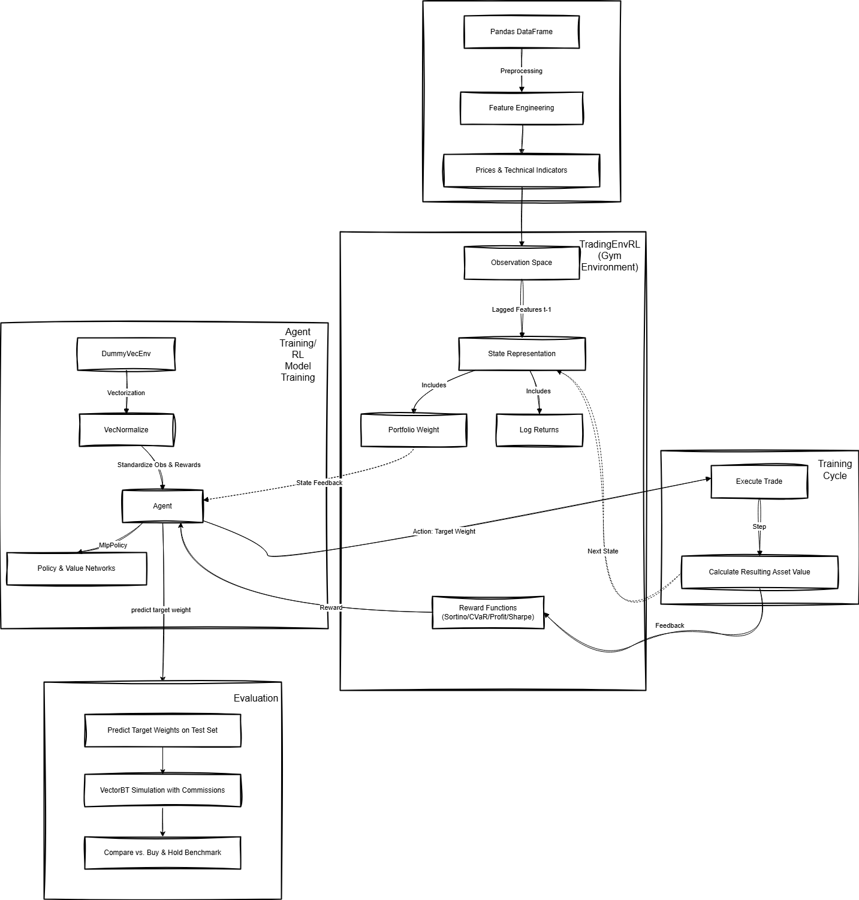

1. rl-get-data.ipynb : คือ notebook ไป collect data จาก yfinance
2. โค้ดเรียกใช้หลักๆ จะอยู่ที่ rl-reward-ppo-buyhold.ipynb และ rl-reward-sac-buyhold.ipynb โดยในนั้นจะไป เรียกใช้ Class จาก model_trainer_rl_v2_2_buyhold.py อีกที

**ใน model_trainer_rl_v2_2_buyhold.py จะมี function หลายตัวที่ไม่ได้เอามาใช้จริงในงานนี้ แค่ทำเผื่อไว้ก่อนเท่านั้น**

สำหรับ Flow ของ Model สามารดูได้ใน

